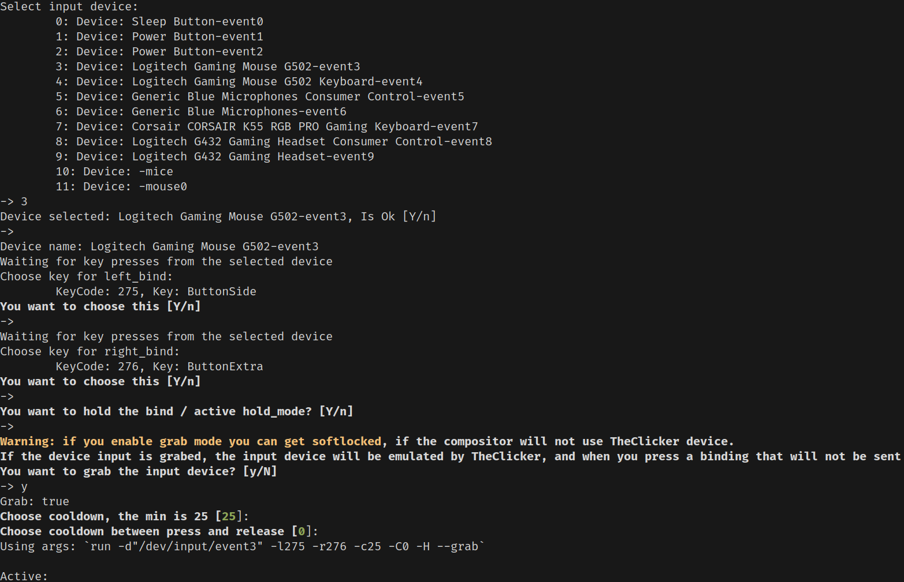

# Simple cli autoclicker for linux
[](https://crates.io/crates/theclicker)

Working on xorg and wayland.

Is using uinput and evdev!

## Running


## Install
```cargo install theclicker```

## To run TheClicker

Run `theclicker`

Select your input device.

Then if is not a legacy interface like: `/dev/input/mouse{N}` or `/dev/input/mice`
You choose the binding for left and right by pressing then confirming.
I recommend hold and grab mode.

Grab mode is only tested on KDE Plasma wayland 6.2.5

You can use `--help` to see more!

## Configuration

TheClicker now supports JSON configuration files to save and load your settings.

### Using Configuration Files

- **Load a specific config file**: `theclicker --config path/to/config.json` or `theclicker -c path/to/config.json`
- **Load default config.json**: `theclicker --default` or `theclicker -d` (loads `config.json` from current directory)

### Creating Configuration Files

When you run the interactive setup, TheClicker will offer to save your configuration to a file. This allows you to:
- Skip the interactive setup on future runs
- Share configurations between different setups
- Quickly switch between different clicking configurations

### Configuration Format

The JSON configuration file has the following structure:

```json
{
  "debug": false,
  "beep": false,
  "command": {
    "type": "Run",
    "device_query": "/dev/input/event3",
    "left_bind": 272,
    "right_bind": 273,
    "lock_unlock_bind": 1,
    "hold": true,
    "grab": true,
    "cooldown": 100,
    "cooldown_press_release": 25
  }
}
```

For legacy devices, use:

```json
{
  "debug": false,
  "beep": false,
  "command": {
    "type": "RunLegacy",
    "device_query": "/dev/input/mouse0",
    "cooldown": 100,
    "cooldown_press_release": 25
  }
}
```

### Configuration Options

- `debug`: Enable debug output (true/false)
- `beep`: Enable beep sounds (true/false)
- `command.type`: Either "Run" for modern devices or "RunLegacy" for PS/2 devices
- `device_query`: Path to the input device
- `left_bind`/`right_bind`: Key codes for left/right mouse buttons
- `lock_unlock_bind`: Key code for toggle lock/unlock (optional)
- `hold`: Enable hold mode (true/false)
- `grab`: Enable grab mode (true/false)
- `cooldown`: Delay between clicks in milliseconds
- `cooldown_press_release`: Delay between press and release in milliseconds

## Build

If you don't have Rust installed you can install rust from [rustup](https://rustup.rs/)

You need to have the stable toolchain installed!

Then run `cargo build --release`

The binary will be in `./target/release/theclicker`

# Problems?

## If crash

Is posibile to not work on any distribution: ```sudo usermod -aG input $USER```

OR

```sudo theclicker```

IF ```sudo theclicker``` RETURNS `sudo: theclicker: command not found`

You should edit you'r /etc/sudoers
if you can find

`Defaults        secure_path="/usr/local/sbin:/usr/local/bin:/usr/sbin:/usr/bin:/sbin:/bin:/snap/bin"`

You should commented like

`#Defaults        secure_path="/usr/local/sbin:/usr/local/bin:/usr/sbin:/usr/bin:/sbin:/bin:/snap/bin"`


And the same thing for

`Defaults        env_reset`
